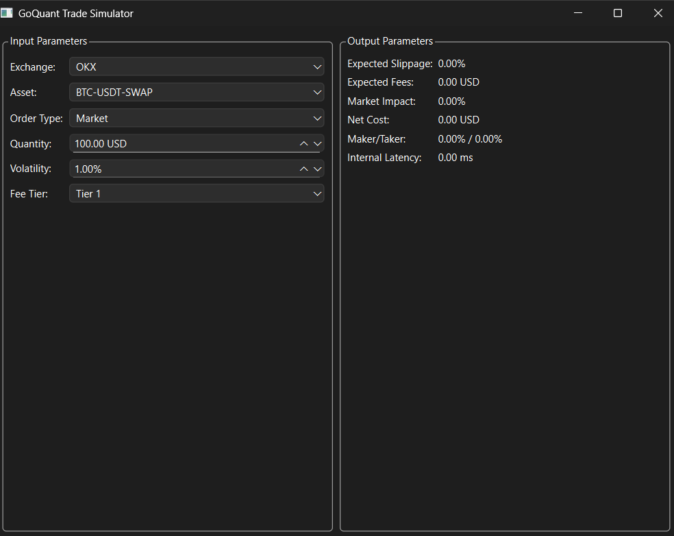

# GoQuant Trade Simulator

A high-performance trade simulator that leverages real-time market data to estimate transaction costs and market impact for cryptocurrency trading.

## Features

- Real-time L2 orderbook data processing
- Market impact analysis using Almgren-Chriss model
- Slippage estimation using regression modeling
- Fee calculation based on exchange tiers
- Maker/Taker proportion prediction
- Performance metrics and latency benchmarking

## Application Output



The application provides a user-friendly interface with:

### Input Panel (Left)
- Exchange selection (OKX)
- Asset selection (BTC-USDT-SWAP)
- Order type (Market)
- Quantity input
- Volatility setting
- Fee tier selection

### Output Panel (Right)
- Expected Slippage
- Expected Fees
- Market Impact
- Net Cost
- Maker/Taker Proportion
- Internal Latency

## Setup

1. Install Python 3.8 or higher
2. Install dependencies:
   ```bash
   pip install -r requirements.txt
   ```
3. Configure your VPN to access OKX exchange
4. Run the application:
   ```bash
   python main.py
   ```

## Project Structure

- `main.py`: Application entry point
- `src/`
  - `ui/`: User interface components
  - `models/`: Trading models and calculations
  - `websocket/`: WebSocket client implementation
  - `utils/`: Utility functions and helpers
- `tests/`: Unit tests
- `docs/`: Documentation
  - `images/`: Application screenshots and diagrams

## Models

### Almgren-Chriss Model
The Almgren-Chriss model is used to estimate market impact and optimal execution strategies. It considers:
- Temporary market impact
- Permanent market impact
- Risk aversion parameter
- Volatility

### Slippage Estimation
Linear regression model for estimating expected slippage based on:
- Order size
- Market depth
- Volatility
- Time of day

### Maker/Taker Proportion
Logistic regression model predicting the probability of order execution as maker vs taker based on:
- Order size
- Price level
- Market conditions
- Historical execution data

## Performance Optimization

The system implements several optimization techniques:
- Asynchronous WebSocket processing
- Efficient data structures for orderbook management
- Multi-threaded UI updates
- Memory-efficient data processing
- Optimized regression model calculations


